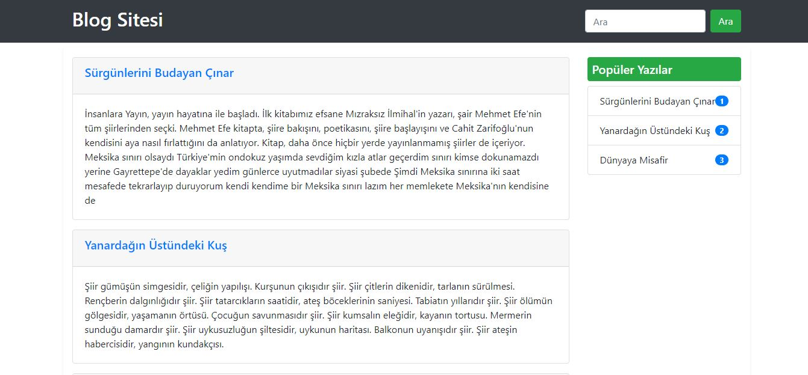

# ReactBlog


## Installation

```
$ git clone https://github.com/SedatBasaran14/ReactBlog.git
$ cd ReactBlog
$ Npm install
```
### `npm start`

Runs the app in the development mode.\
Open [http://localhost:3000](http://localhost:3000) to view it in the browser.

The page will reload if you make edits.\
You will also see any lint errors in the console.

## The goal of the project

I wrote the pages in components using React. I did not get the articles from a database. Instead, I created text and comment 'Api's.


